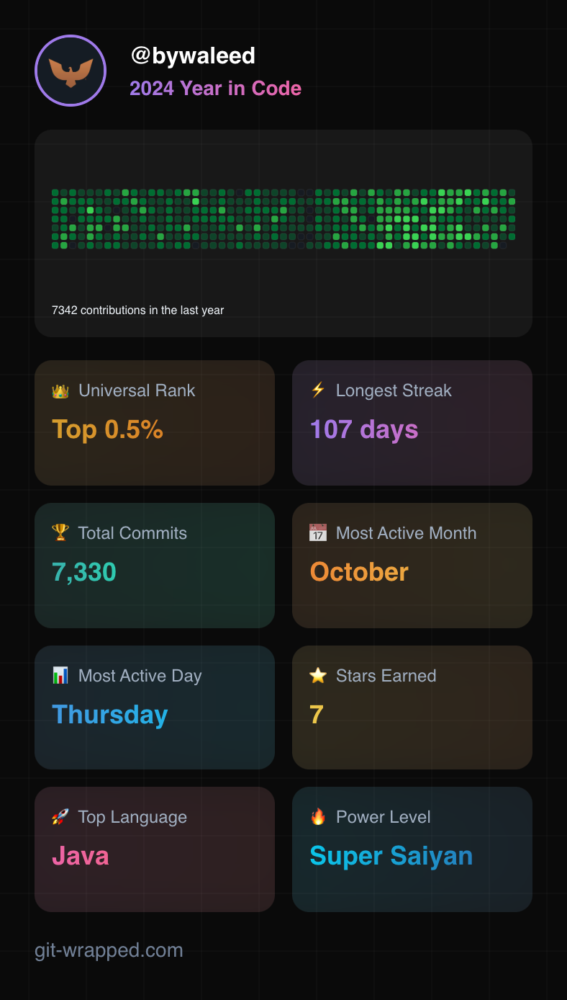

# Hi there, I'm Waleed 👋
I'm a passionate full stack developer with a keen interest in leading & implementing end to end software development projects.

## Quick Overview
- 👨‍💻 Software Engineer @BBC | Ex Lead @Google
- 🌱 I’m currently finishing off Software Engineering Masters @ University of Oxford 🤓
- 👯 I’m looking to collaborate on Web, TV, AI and DevOps projects
- 💬 Ask me about Web, TV, AI/ML, Blockchain, DevOps, Hardware, Networking 
- ⚡ Fun fact: I play competitive Cricket (2021 & 2022 Champions 🥇)

## 🔧 Technologies & Tools

- **Languages:** Python, JavaScript, TypeScript, Java, PHP, C++
- **Frontend:** React, Astro, Gatsby, VueJS, Jest, Playwright, Chromatic, Express, Django, Flask, Laravel, JavaFX
- **Backend:** NodeJS, NextJS, ExpressJS, Java Spring, Flask, Laravel, REST API, Docker
- **Databases:** MySQL, PostgreSQL, MongoDB, Supabase
- **Tools & Platforms:** Git, Docker, AWS, CI/CD

## 🌱 Currently Learning

- Machine Learning & Deep Learning with PyTorch
- Machine Learning Engineering (depoloyment & operations)
- System Design and Architecture

## 📫 How to Reach Me
  
- **Email:** [hi@waleedislam.co.uk](mailto:hi@waleedislam.co.uk)

## 📈 GitHub Stats

